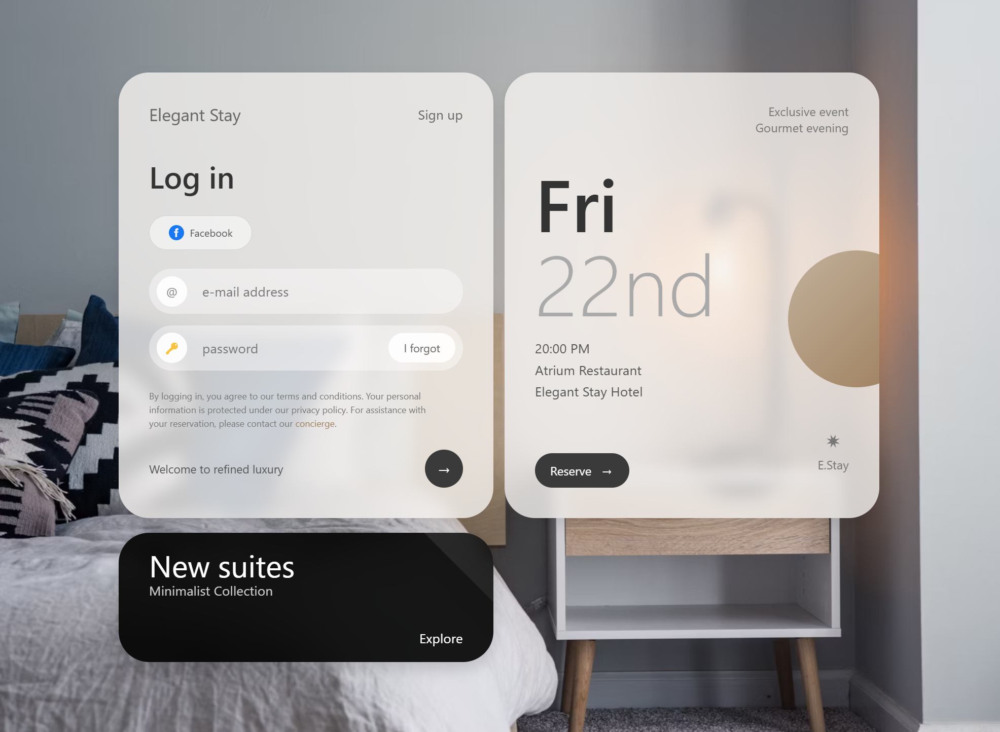
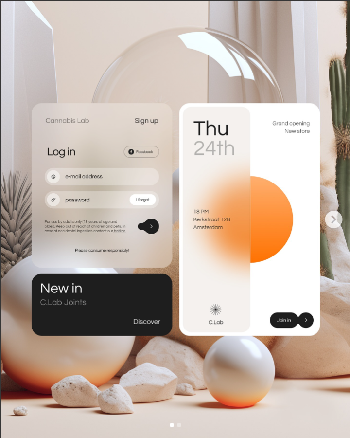

# Luxury Hotel Login Demo

A responsive and interactive hotel login UI concept created with the assistance of Claude 3.7 Sonnet via Poe.

**README Language Options**
- [English (Current)](README.md)
- [中文](README.zh-CN.md)

<strong>Project Background</strong> (Click to expand)

This demo was created using simple prompts along with reference images from pxdx.studio. Through less than 10 conversation rounds with Claude 3.7 Sonnet (in fact, the basic implementation was achieved in just 3 rounds, which was incredibly efficient), I was able to create this design. The interactive animations were implemented in about 2 rounds, with the remaining time spent on fine-tuning details like fonts, copy text, and color adjustments.

While this is just a demo with several limitations that might prevent it from being used in any actual project, for someone like me with no prior AI frontend programming experience, building such an impressive webpage in under 10 minutes was an incomparable delight.

<strong>AI Prompts I Used</strong> (Click to expand)

> 1. "Completely analyze this interface's functionality and interaction logic, then implement a similar interface with interactive features and a simple data backend, with a frosted glass design style."

> 2. "Can you mimic this part of the design style as much as possible? You can first analyze its layout and design style."

These simple prompts, combined with reference images, were all that was needed to generate the functional code.

<strong>Disclaimer of Commercial Relationship</strong> (Click to expand)

I am a paid user of Poe and have no commercial partnership, affiliation, or financial relationship with Anthropic (creators of Claude) or Poe. This demo was created for personal educational purposes only. Any mention of Claude 3.7 Sonnet or Poe is purely for attribution of the tools used in creation.

<strong>External Resources Disclaimer</strong> (Click to expand)

This demo includes references to external resources through its Content Security Policy (CSP). The original code was generated using Claude 3.7 Sonnet on the Poe platform, which automatically adds these CSP permissions to allow various external libraries and resources to function if needed.

### Important Notes:

1. **Background Image**: The demo uses a background image from Unsplash (`https://images.unsplash.com/photo-1522771739844-6a9f6d5f14af`). This is the only external resource actively loaded in the implementation.

2. **Content Security Policy**: The HTML code contains a comprehensive CSP that includes permissions for various external resources like Bootstrap (via maxcdn.bootstrapcdn.com), jQuery, and other libraries. This CSP was automatically generated by the Poe platform and does not necessarily reflect which resources are actually being loaded by the page.

3. **Actual Resource Usage**: While the CSP permits access to many external resources, the page itself may not actually load all these resources. You would need to examine the specific `<script>` and `<link>` tags in the HTML to determine which external resources are actually being used.

4. **Unicode Icons**: Some Unicode characters are used as icons (such as 🔑), which are part of standard character sets and don't require external resources.

5. **No Data Collection**: This demo does not collect, store, or transmit any user data. The login functionality is simulated and no actual authentication occurs.

## Features

- Clean, modern luxury hotel login interface
- Responsive design that works on mobile and desktop
- Smooth animations and transitions
- Form validation with visual feedback
- Promotional section showcasing hotel events and offerings

<strong>Usage</strong> (Click to expand)

This is a demonstration project only. Feel free to use it as inspiration for your own projects, but please note the attribution requirements below.

<strong>Attribution</strong> (Click to expand)

- UI concept and implementation created with Claude 3.7 Sonnet
- Background image from Unsplash
- Design inspiration from pxdx.studio
- This demo's design references a concept by pxdx.studio: https://www.instagram.com/p/C7j8A5Et67s/?utm_source=ig_web_copy_link
- 
- While attribution is not strictly required, I would greatly appreciate if you credit @lepadphone when using or referencing this work

<strong>License</strong> (Click to expand)

This project is available for educational and personal use only. **Commercial use is strictly prohibited**. Any derivative works must maintain this non-commercial restriction.

[View the Demo](luxury-hotel-login-demo-claude-3.7-sonnet.html)

---

*P.S. Both of these README files were generated by Claude 3.7 Sonnet. If you find any errors, please consider it part of the entertainment or feel free to point them out in the comments!*
