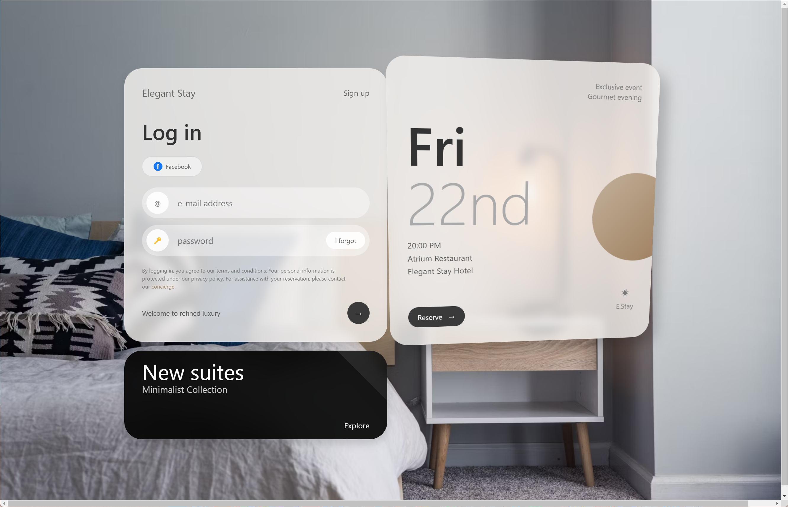

# ✨ Luxury Hotel Login Demo 🏨

A **responsive** and **interactive** hotel login UI concept, designed with the assistance of **Claude 3.7 Sonnet** via Poe. 🌟

  

  
  

---

## 📌 Features
✅ **Luxury hotel-inspired UI** 🎨 
✅ **Fully responsive** 📱💻  
✅ **Smooth animations & transitions** 🎬✨  
✅ **Form validation with feedback** ✅🔒  
✅ **Promotional section for hotel offerings** 🏨🍹  

---

## 📖 **Project Details**

<strong>📜 Project Background</strong> (Click to expand) 🔍

🎯 This demo was crafted using **simple prompts + reference images** from `pxdx.studio`.  
💡 **Efficiency**: The core design was completed in just **3 conversation rounds**!  
⚡ **Interactivity**: Animations were added in only **2 rounds**!  
🎨 **Final tuning**: Fonts, text, and colors were adjusted in the last phase.  

Although this is **just a demo**, it showcases how **AI-powered frontend design** can be done in **minutes** even for beginners! 🚀

<strong>🧠 AI Prompts Used</strong> (Click to expand) 💬

💻 **Prompt 1**:  
> `"Completely analyze this interface's functionality and interaction logic, then implement a similar interface with interactive features and a simple data backend, with a frosted glass design style."`

🎨 **Prompt 2**:  
> `"Can you mimic this part of the design style as much as possible? You can first analyze its layout and design style."`

These minimal prompts, combined with reference images, were enough to **generate functional code** with high accuracy! 🔥

<strong>⚖️ Disclaimer of Commercial Relationship</strong> (Click to expand) 🚫

🚀 I am a **paid user of Poe**, but **I have no commercial affiliation** with **Anthropic (Claude)** or **Poe**.  

💡 This project was created **purely for learning and exploration**. Any mention of `Claude 3.7 Sonnet` or `Poe` is **for transparency and attribution purposes only**.

<strong>🌠External Resources Disclaimer</strong> (Click to expand) 🔗

This project includes **references to external resources** via **Content Security Policy (CSP)**. Here are key points:  

1️⃣ **Background Image**:  
   - 🌆 Sourced from **Unsplash** (`https://images.unsplash.com/photo-1522771739844-6a9f6d5f14af`).  
   
2️⃣ **Content Security Policy**:  
   - 🔐 Includes permissions for **Bootstrap, jQuery**, etc.  
   - 🔍 These permissions were **auto-generated** and may **not all be used**.  

3️⃣ **Actual Resource Usage**:  
   - 📄 Only some external resources are actually loaded – check the **`<script>` and `<link>` tags** to confirm.  

4️⃣ **🔑 Unicode Icons**:  
   - This demo uses **Unicode characters** (e.g., `🔑`) instead of external icon libraries.  

5️⃣ **❌ No Data Collection**:  
   - This project does **not** collect, store, or process **any user data** – login is **simulated**.

---

## 🚀 **How to Use**

<strong>🛠️ Usage</strong> (Click to expand) 💡

This project is for **demonstration purposes only**.  
Feel free to use it for **learning & inspiration**, but please respect the **attribution guidelines** below. 🎨🙏

<strong>🨠Attribution</strong> (Click to expand) âœï¸

- **UI & Code** → Created with **Claude 3.7 Sonnet** 🤖  
- **Background** → Image from **Unsplash** 📷  
- **Design Reference** → Inspired by `pxdx.studio` 🎨 
- **Original Concept** → [Instagram Post](https://www.instagram.com/p/C7j8A5Et67s/?utm_source=ig_web_copy_link)  

📌 **Reference Image:**  
  

🙏 If you use or reference this work, I’d **greatly appreciate** a credit to `@lepadphone`! 🎉

---

## 📜 **License**

<strong>📄 License</strong> (Click to expand) 🚫

⚠️ **This project is for educational and personal use only.**  

❌ **Commercial use is strictly prohibited.**  
📌 **Any derivative works must retain this non-commercial restriction.**

---

## 💬 **Final Thoughts**
🔹 This README was enhanced with **better formatting, emoji highlights, and visual organization**.  
🔹 The **collapsible sections** keep it **structured & easy to navigate**.  
🔹 The **demo remains simple yet elegant**, showcasing AI-driven **design & development**.  

🔥 **Enjoy the project & happy coding!** 🚀🎨 

---

## **P.S.**  
🤖 Both of these README versions were originally generated by `Claude 3.7 Sonnet`.  
🎭 If you find any **mistakes or quirks**, either enjoy them as **part of the AI experience** or drop a comment! 💡😆  
